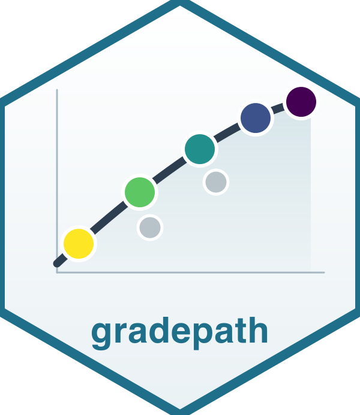
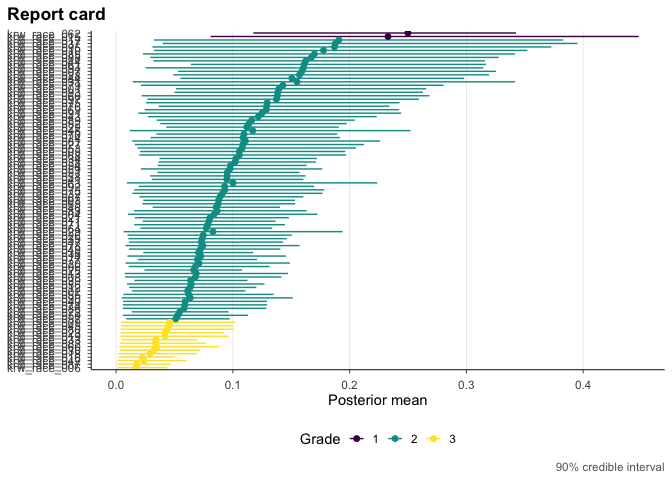

<!-- README.md is generated from README.Rmd. Please edit that file -->

# gradepath 

[](https://lifecycle.r-lib.org/articles/stages.html#experimental)
[](https://opensource.org/licenses/MIT)
[](https://github.com/joonho112/gradepath/actions/workflows/R-CMD-check.yaml)

Firm-level estimates of discrimination are noisy, and the noise differs
sharply across firms: some firms are measured from thousands of
applications and others from a handful, so a raw ranking mostly sorts on
sampling error. **gradepath** sorts firms by what the data actually
support — pooling information across firms to shrink the noise, ordering
them by posterior evidence, and assigning each one a discrete integer
grade with an honest credible interval. It is a native-R replication of
the discrimination-report-card analysis of Kline, Rose, and Walters
(2024, *AER*), replacing the original Stata + R + Python + MATLAB +
Gurobi pipeline with a single package.

## The method in three steps

1.  **Estimate.** Standardize each firm’s discrimination estimate onto a
    common precision scale with a beta-GMM precision rule, so a firm
    measured from few applications is not mistaken for a confident
    outlier.
2.  **Rank.** Deconvolve the underlying prior across firms via empirical
    Bayes, shrink each firm’s estimate toward it, then build a pairwise
    posterior outranking matrix that records, for every pair, the
    probability that one firm is more discriminatory than the other.
3.  **Grade.** Solve a Bayes-risk integer program that turns those
    posterior comparisons into a small set of discrete grades, choosing
    how fine to grade by moving along an information-reliability
    frontier.

No equations here — see the **Method** vignettes (M1–M5) for the full
notation and derivation.

## Installation

``` r
# install.packages("remotes")
remotes::install_github("joonho112/gradepath")
# or clone:  gh repo clone joonho112/gradepath
```

The grade integer program solves with **Gurobi by default** (the
recommended backend; it needs a Gurobi license and `gurobi_cl` on your
`PATH`) or falls back to the open, license-free **HiGHS** backend
(several times slower on a real 97-firm solve). The package installs,
loads, and passes its tests **without any solver** — you only need a
backend when you run a live grade solve yourself.

## A five-minute example

Conceptually, the whole pipeline is a **single call**. The grade step
solves an integer program over all 97 firms (~3 min with Gurobi), so we
do **not** run it inline here:

``` r
# Read the bundled per-firm beta-GMM series (97 firms; col 2 = theta_hat, col 3 = s).
gmm  <- read.csv(system.file("extdata/krw-gmm-input/theta_estimates_matlab_race.csv",
                             package = "gradepath"), header = FALSE)
race <- list(theta_hat = gmm[[2]], s = gmm[[3]])

# The whole pipeline is one call. The grade step solves an integer program over
# 97 firms (~3 min with Gurobi), so we do not run it inline here:
fit <- krw_report_card(race, demographic = "race",
                       control = gp_control(backend = "gurobi",
                                            precision_rule = "krw_gmm",
                                            lambda_grid = c(0.25, 0.5, 1)))
```

So that this page knits instantly and without a solver, **gradepath**
ships the proven race result. Load it (no solve) and print it:

``` r
library(gradepath)
# gradepath ships the proven RACE result; load it instantly (no solve):
fit <- readRDS(system.file("extdata/cached/fit_race_parity.rds", package = "gradepath"))
fit
#> +------------------------------------------------------------------------+
#> | gp_fit  .  97 units  .  grades: 3 (2/81/14)  .  selected lambda = 0.25 |
#> +------------------------------------------------------------------------+
#> | units      : 97                                                        |
#> | grades     : 3 (2/81/14)                                               |
#> | reliability: (1 - DR) = 0.96   tau-bar = 0.21                          |
#> | backend    : gurobi                                                    |
#> +------------------------------------------------------------------------+
#> i  summary(fit) for backend/selection details; get_report_card(fit) for the ranked table.
```

Then draw the report card for those 97 firms:

``` r
gp_plot_report_card(get_report_card(fit))
```



Reading the output: across **97 units**, the analysis lands on **3
integer grades** holding 2, 81, and 14 firms, at the KRW baseline
`lambda = 0.25`. The reliability summary `(1 - DR) = 0.96` says the
grading reproduces the underlying posterior ordering with high fidelity,
`tau-bar = 0.21` summarizes the average spread within a grade, and the
solve used the `gurobi` backend. Grade **1** is simply the most-extreme
grade — an integer label in `1..n`, here the two firms the data place
farthest along the discrimination scale — not a verdict about any firm;
the grades are a sorting by posterior evidence, and the credible
intervals tell you how firmly each placement is supported.

## Key features

- **Native-R replication** of the full Kline-Rose-Walters estimation
  core — beta-GMM precision standardization, empirical-Bayes
  deconvolution and shrinkage, the pairwise outranking matrix, the
  Bayes-risk grade integer program, and the information-reliability
  frontier — with no Stata, Python, MATLAB, or hand-offs between
  languages.
- **Gurobi by default**, with the open **HiGHS** backend so the workflow
  runs without a commercial license.
- **The four signature KRW figures** as composable `ggplot2` verbs
  (frontier, posterior contrast, report card, discordance).
- **Discrete integer-grade report cards** with per-firm posterior
  credible intervals.
- **A Monte-Carlo calibration harness** for checking that the grades are
  well-calibrated.
- **A two-level industry surface** for grading industries as well as
  firms.

## Vignettes

**Applied track** — run, read, and export:

| Article | Title |
|----|----|
| [a1-getting-started](https://joonho112.github.io/gradepath/articles/a1-getting-started.html) | A1: Getting started — your first discrimination report card |
| [a2-the-grading-workflow](https://joonho112.github.io/gradepath/articles/a2-the-grading-workflow.html) | A2: The grading workflow — from estimates to a report card |
| [a3-reading-and-exporting-results](https://joonho112.github.io/gradepath/articles/a3-reading-and-exporting-results.html) | A3: Reading and exporting results |
| [a4-figures](https://joonho112.github.io/gradepath/articles/a4-figures.html) | A4: The figure cookbook |
| [a5-solvers-and-calibration](https://joonho112.github.io/gradepath/articles/a5-solvers-and-calibration.html) | A5: Solvers and calibration |

**Method track** — the derivation behind each step:

| Article | Title |
|----|----|
| [m1-foundations-and-notation](https://joonho112.github.io/gradepath/articles/m1-foundations-and-notation.html) | M1: Foundations and notation |
| [m2-precision-and-standardization](https://joonho112.github.io/gradepath/articles/m2-precision-and-standardization.html) | M2: Precision and standardization |
| [m3-deconvolution-and-posterior](https://joonho112.github.io/gradepath/articles/m3-deconvolution-and-posterior.html) | M3: Deconvolution and posterior |
| [m4-grading-frontier-and-report-cards](https://joonho112.github.io/gradepath/articles/m4-grading-frontier-and-report-cards.html) | M4: Grading, the frontier, and report cards |
| [m5-two-level-and-calibration](https://joonho112.github.io/gradepath/articles/m5-two-level-and-calibration.html) | M5: Two-level industries and calibration |

## Status and performance notes

This is a **pre-release** (v0.5.0, lifecycle *experimental*). The
scoping below is exact — please read it before relying on results.

- The one-level **race and gender core (M1) is accepted under a
  predeclared scoped policy.** It recovers the published grade
  distributions (race 2 / 81 / 14, gender 1 / 3 / 89 / 4) as
  **proven-optimal** solves (`mip_gap = 0`) at the KRW baseline
  `lambda = 0.25`, with `beta = 0.5095` (race) and `beta = 1.2554`
  (gender) matching the paper.
- The **two-level industry surface (M2) is partially accepted**: exact
  industry grade counts are reproduced; some continuous rows rest on
  fixture-parity evidence rather than direct reproduction.
- **Performance.** The 97-firm grade integer program takes ~3 min with
  Gurobi; HiGHS is license-free but several times slower. No example in
  this README runs a live solve — the headline numbers load the bundled
  proven fit.

## Citation

To cite gradepath, cite both the package and the method it replicates:

    @Manual{gradepath,
      title  = {gradepath: Discrimination Report Cards via a Native Kline-Rose-Walters Core},
      author = {JoonHo Lee},
      year   = {2026},
      note   = {R package version 0.5.0},
      url    = {https://joonho112.github.io/gradepath/},
    }

    @Article{kline2024discrimination,
      title   = {A Discrimination Report Card},
      author  = {Patrick Kline and Evan K. Rose and Christopher R. Walters},
      journal = {American Economic Review},
      year    = {2024},
      volume  = {114},
      number  = {8},
      pages   = {2472--2525},
      doi     = {10.1257/aer.20230700},
    }

## Related work

- [**ebrecipe**](https://github.com/joonho112/ebrecipe) supplies the
  low-level empirical-Bayes primitives (prior deconvolution and
  posterior shrinkage) that gradepath builds on behind a controlled seam
  — as an input container plus a one-level cross-check, not a stage
  orchestrator.
- [**drrank**](https://github.com/ekrose/drrank) is the original
  authors’ reference implementation of the grade-optimization step for
  *A Discrimination Report Card*; gradepath reproduces that step
  natively in R rather than calling out to it.

## Getting help

Found a problem, or have a question? Please open an issue at
<https://github.com/joonho112/gradepath/issues>.

## License

MIT © JoonHo Lee. See [`LICENSE.md`](LICENSE.md).

Created and maintained by **JoonHo Lee** ([ORCID
0009-0006-4019-8703](https://orcid.org/0009-0006-4019-8703)), Assistant
Professor, The University of Alabama (<jlee296@ua.edu>).
